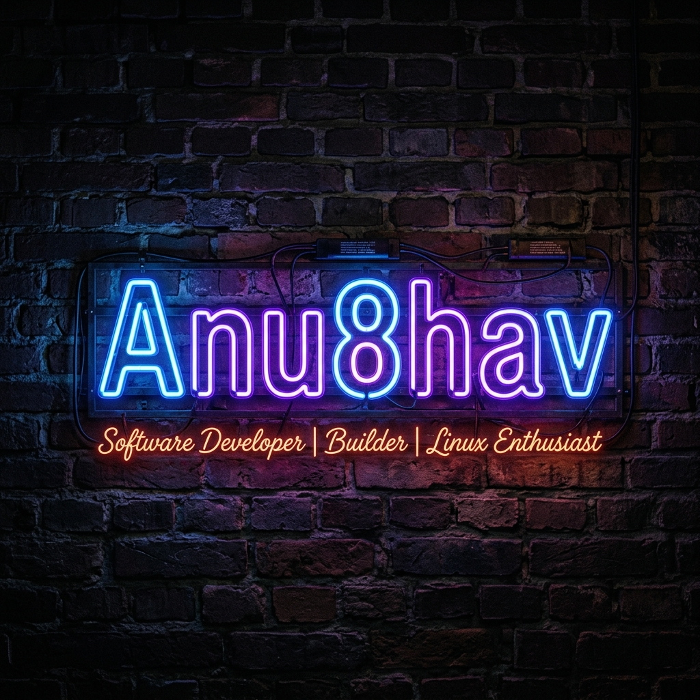

<!-- ═══════════════════════════════════════════════════════════════════════════ -->
<!-- HERO BANNER — NEON SIGN -->
<!-- ═══════════════════════════════════════════════════════════════════════════ -->

<div align="center">



<!-- ═══════════════════════════════════════════════════════════════════════════ -->
<!-- ANIMATED TYPING INTRODUCTION -->
<!-- ═══════════════════════════════════════════════════════════════════════════ -->

<a href="https://git.io/typing-svg">
  
</a>

<br/><br/>

<!-- VISITOR COUNTER -->

&nbsp;
<a href="https://github.com/Anu8hav?tab=repositories"></a>
&nbsp;
<a href="https://github.com/Anu8hav?tab=followers"></a>

</div>

<br/>

<!-- ═══════════════════════════════════════════════════════════════════════════ -->
<!-- ABOUT ME -->
<!-- ═══════════════════════════════════════════════════════════════════════════ -->

##  &nbsp;About Me


Software developer and MCA student who enjoys building modern, scalable applications. I spend most of my time writing TypeScript, experimenting with full-stack architectures, and tinkering with my Arch Linux + Hyprland setup.

- 🔨 &nbsp;Currently building **[SchoolSync](https://github.com/Anu8hav/SchoolSync)** — a modern school management platform
- 🌱 &nbsp;Deepening my skills in **backend engineering** and **system design**
- ☁️ &nbsp;Exploring **cloud technologies** and scalable architecture
- 🐧 &nbsp;Daily driving **Arch Linux** with **Hyprland** WM
- 🤝 &nbsp;Open to collaborating on **open source** projects
- ☕ &nbsp;Fueled by coffee and curiosity

<br clear="right"/>

<!-- ═══════════════════════════════════════════════════════════════════════════ -->
<!-- TERMINAL WHOAMI -->
<!-- ═══════════════════════════════════════════════════════════════════════════ -->

## 🖥️ &nbsp;Terminal

```bash
anu8hav@arch:~$ whoami
─────────────────────────────────────────────────────
  User      :  Anu8hav
  Role      :  Software Developer & MCA Student
  OS        :  Arch Linux (btw)
  WM        :  Hyprland
  Editor    :  VS Code / Neovim
  Shell     :  zsh
─────────────────────────────────────────────────────

anu8hav@arch:~$ cat interests.txt
  ► Full Stack Development
  ► Backend Engineering
  ► System Design & Architecture
  ► Cloud Computing
  ► Open Source
  ► UI/UX Design
  ► Developer Experience

anu8hav@arch:~$ cat current_focus.txt
  ► Building production-ready applications
  ► Improving backend development skills
  ► Learning scalable software architecture
  ► Exploring cloud technologies
  ► Writing clean and maintainable code

anu8hav@arch:~$ echo $MOTTO
  "Always learning something new."
```

<!-- ═══════════════════════════════════════════════════════════════════════════ -->
<!-- TECH ARSENAL -->
<!-- ═══════════════════════════════════════════════════════════════════════════ -->

## ⚡ &nbsp;Tech Arsenal

<div align="center">

### Languages
<a href="https://skillicons.dev">
  
</a>

### Frontend
<a href="https://skillicons.dev">
  
</a>

### Backend & Database
<a href="https://skillicons.dev">
  
</a>

### Tools & Environment
<a href="https://skillicons.dev">
  
</a>

</div>

<br/>

<!-- ═══════════════════════════════════════════════════════════════════════════ -->
<!-- GITHUB ANALYTICS -->
<!-- ═══════════════════════════════════════════════════════════════════════════ -->

## 📊 &nbsp;GitHub Analytics

<div align="center">
  <a href="https://github.com/Anu8hav">
    
  </a>
  &nbsp;&nbsp;
  <a href="https://github.com/Anu8hav">
    
  </a>
</div>

<br/>

<!-- ═══════════════════════════════════════════════════════════════════════════ -->
<!-- CONTRIBUTION STREAK -->
<!-- ═══════════════════════════════════════════════════════════════════════════ -->

<div align="center">
  <a href="https://github.com/Anu8hav">
    
  </a>
</div>

<br/>

<!-- ═══════════════════════════════════════════════════════════════════════════ -->
<!-- ACTIVITY GRAPH -->
<!-- ═══════════════════════════════════════════════════════════════════════════ -->

<div align="center">
  <a href="https://github.com/Anu8hav">
    
  </a>
</div>

<br/>

<!-- ═══════════════════════════════════════════════════════════════════════════ -->
<!-- SNAKE CONTRIBUTION ANIMATION -->
<!-- ═══════════════════════════════════════════════════════════════════════════ -->

<div align="center">
  <picture>
    <source media="(prefers-color-scheme: dark)" srcset="https://raw.githubusercontent.com/Anu8hav/Anu8hav/output/github-snake-dark.svg" />
    <source media="(prefers-color-scheme: light)" srcset="https://raw.githubusercontent.com/Anu8hav/Anu8hav/output/github-snake.svg" />
    
  </picture>
</div>

<br/>

<!-- ═══════════════════════════════════════════════════════════════════════════ -->
<!-- FEATURED PROJECTS -->
<!-- ═══════════════════════════════════════════════════════════════════════════ -->

## 🚀 &nbsp;Featured Projects

<div align="center">

<a href="https://github.com/Anu8hav/SchoolSync">
  
</a>
&nbsp;&nbsp;
<a href="https://github.com/Anu8hav/NJ-Design-Studio">
  
</a>

</div>

<br/>

<table align="center">
  <tr>
    <td align="center" width="50%">
      <h3>🏫 SchoolSync</h3>
      <p>A modern school management platform focused on simplifying administration, student management, attendance tracking, scheduling, and overall academic workflow through an intuitive interface.</p>
      <a href="https://github.com/Anu8hav/SchoolSync"></a>
    </td>
    <td align="center" width="50%">
      <h3>🏛️ NJ Design Studio</h3>
      <p>A modern portfolio website developed for an architect to establish a professional online presence and showcase architectural work.</p>
      <a href="https://github.com/Anu8hav/NJ-Design-Studio"></a>
    </td>
  </tr>
</table>

<br/>

<!-- ═══════════════════════════════════════════════════════════════════════════ -->
<!-- CURRENTLY LEARNING -->
<!-- ═══════════════════════════════════════════════════════════════════════════ -->

## 📚 &nbsp;Currently Learning

```text
☁️  Cloud Technologies        ████████████░░░░░░░░  60%
🏗️  System Design             ██████████░░░░░░░░░░  50%
⚙️  Backend Engineering       ████████████████░░░░  80%
🐳  Docker & Containers       ██████████████░░░░░░  65%
📐  Software Architecture     ████████████░░░░░░░░  60%
```

<!-- ═══════════════════════════════════════════════════════════════════════════ -->
<!-- 2026 GOALS -->
<!-- ═══════════════════════════════════════════════════════════════════════════ -->

## 🎯 &nbsp;2026 Goals

- 🚢 &nbsp;Ship **production-ready** applications
- 🌐 &nbsp;Contribute more to **open source** projects
- 🧠 &nbsp;Master **system design** fundamentals
- ☁️ &nbsp;Get hands-on with **cloud infrastructure**
- 📝 &nbsp;Start writing **technical articles**
- 🤝 &nbsp;Collaborate with developers worldwide

<!-- ═══════════════════════════════════════════════════════════════════════════ -->
<!-- FUN FACTS -->
<!-- ═══════════════════════════════════════════════════════════════════════════ -->

## 🎲 &nbsp;Fun Facts

```yaml
os: "Arch Linux (btw)"
wm: "Hyprland — because tiling is life"
terminal: "First tool I open every morning"
ui_philosophy: "If it doesn't look clean, it's not done"
debug_strategy: "console.log until it makes sense"
coffee_intake: "Dangerously high"
tabs_vs_spaces: "Tabs. Fight me."
```

<!-- ═══════════════════════════════════════════════════════════════════════════ -->
<!-- SPOTIFY — uncomment when linked -->
<!-- ═══════════════════════════════════════════════════════════════════════════ -->

<!--
## 🎧 &nbsp;Now Playing

<div align="center">
  <a href="https://spotify-github-profile.kittinanx.com/api/view?uid=YOUR_SPOTIFY_ID&redirect=true">
    
  </a>
</div>
-->

<!-- ═══════════════════════════════════════════════════════════════════════════ -->
<!-- RANDOM DEV QUOTE -->
<!-- ═══════════════════════════════════════════════════════════════════════════ -->

## 💭 &nbsp;Dev Quote

<div align="center">
  
</div>

<br/>

<!-- ═══════════════════════════════════════════════════════════════════════════ -->
<!-- CONNECT WITH ME -->
<!-- ═══════════════════════════════════════════════════════════════════════════ -->

## 🤝 &nbsp;Connect With Me

<div align="center">

<a href="https://github.com/Anu8hav">
  
</a>
&nbsp;
<a href="https://www.linkedin.com/in/anubhavnath/">
  
</a>
&nbsp;
<a href="mailto:anu.anubhav.nath@gmail.com">
  
</a>

</div>

<br/>

<!-- ═══════════════════════════════════════════════════════════════════════════ -->
<!-- FOOTER -->
<!-- ═══════════════════════════════════════════════════════════════════════════ -->

<div align="center">


<br/>

<sub>Built with ☕ and curiosity &nbsp;|&nbsp; Always learning something new.</sub>

</div>
